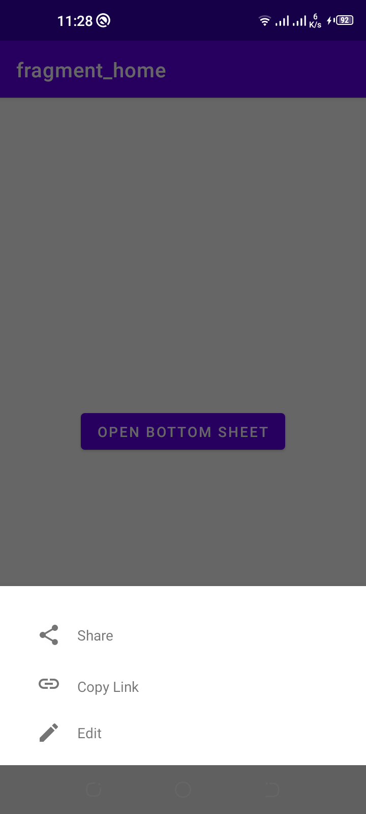

#Modal Bottom Sheet
According to google material design documentation; A bottom sheet is a sheet that slides up from the bottom edge of the screen. Bottom sheets are displayed as a result of user triggered action, and also it can reveal additional content by swiping up

## Demo

  
